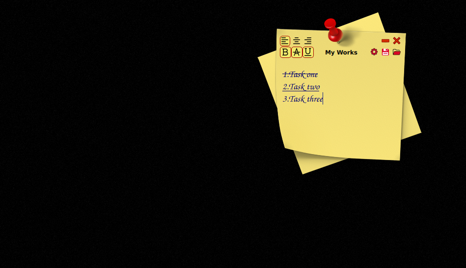

# DesktopNote
A small note paper for writing daily tasks on the desktop

download and use it from [here](https://github.com/parisa-hr/DesktopNote/releases)

**It has these options:**

  1. Save and load your Note as a text file.
  2. some tools for text like (Bold, StrikeOut, Underline, change Alignment )
  3. Setting for change font color and family and size
  4. Remember window position and settings
  

# Demo of app

